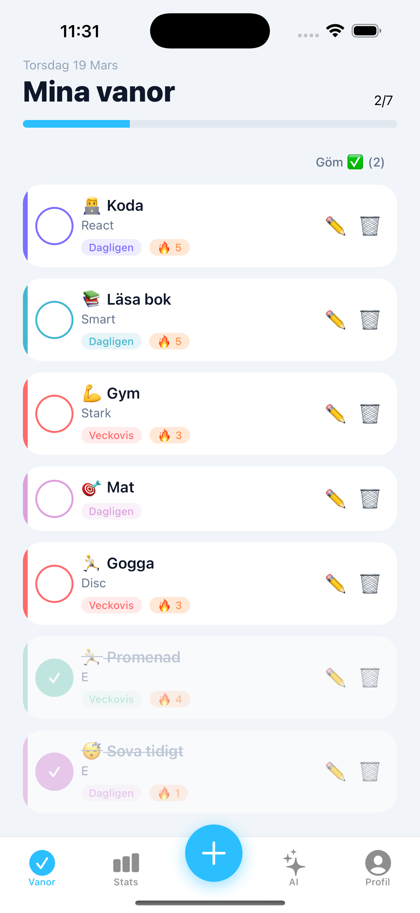
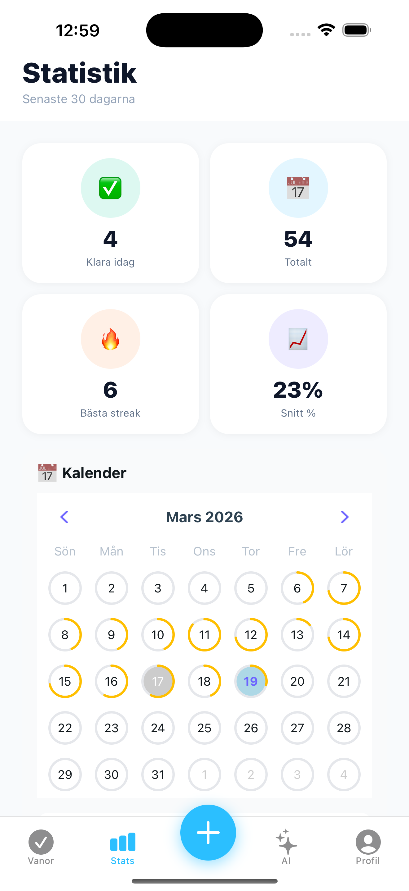
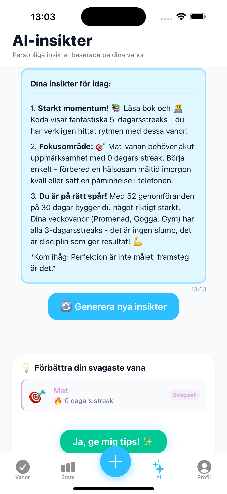
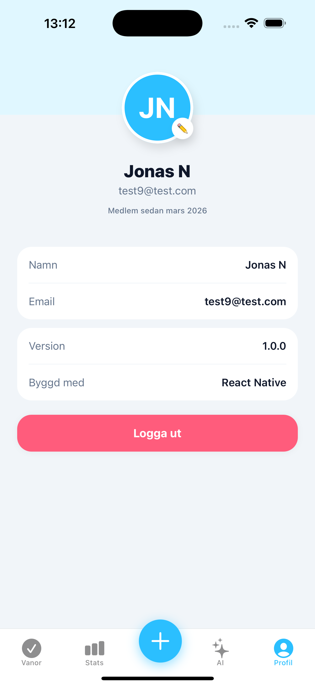

# 📱 HabitTracker

En mobilapplikation för att spåra och analysera dagliga vanor, byggd med React Native och AWS serverless-arkitektur.

> **Examensarbete** — Folkuniversitetet, 2026

---

## 📸 Screenshots

| Vanor | Statistik | AI-insikter | Profil |
|-------|-----------|-------------|--------|
|  |  |  |  |

---

## ✨ Funktioner

### MVP (Implementerat)
- ✅ **Konto & Inloggning** — Registrering och inloggning via AWS Cognito
- ✅ **Skapa & Redigera vanor** — Med ikon, färg och frekvens (dagligen/veckovis/månadsvis)
- ✅ **Markera genomförda** — Toggle med animation och streak-räknare
- ✅ **Statistik** — Streaks, completion rate, bar chart, kalendervy
- ✅ **AI-insikter** — Personliga insikter genererade av Claude AI
- ✅ **Tips för svagaste vana** — AI-genererade förbättringstips
- ✅ **Profil** — Redigera namn, se medlemsinfo

### Extra funktioner
- 🎨 Modernt färgschema med Cyan/Blå tema
- 📅 Kalendervy med progress-ringar per dag
- 🔥 Streak-tracking per vana
- 💡 Detaljvy per vana (30 dagars data)
- 🌍 Svensk kalender
- ⚡ Global state med 30 sekunders cache
- 🤖 Claude AI via AWS Lambda (inte direkt från frontend)
- 🔒 Säker API-nyckelhantering via miljövariabler

---

## 🏗️ Arkitektur

```
┌─────────────────────────────────┐
│     React Native (Expo)         │
│     Expo Router v6              │
└────────────────┬────────────────┘
                 │ HTTPS / REST
┌────────────────▼────────────────┐
│     API Gateway (REST)          │
│     Cognito Authorizer          │
└────────────────┬────────────────┘
                 │
┌────────────────▼────────────────┐
│     AWS Lambda (Node.js 18)     │
│     Serverless Framework 4      │
└────────────────┬────────────────┘
                 │
        ┌────────┴────────┐
        │                 │
┌───────▼──────┐  ┌───────▼──────┐
│  DynamoDB    │  │  Claude API  │
│  (4 tabeller)│  │  (Anthropic) │
└──────────────┘  └──────────────┘
        │
┌───────▼──────┐
│  AWS Cognito │
│  User Pool   │
└──────────────┘
```

---

## 🛠️ Tech Stack

### Frontend
| Teknologi | Version | Syfte |
|-----------|---------|-------|
| React Native | 0.81.5 | Mobilramverk |
| Expo | 54.0.33 | Build & tooling |
| Expo Router | 6.x | Filbaserad routing |
| TypeScript | 5.9 | Typsäkerhet |
| Axios | 1.x | HTTP-klient |
| react-native-calendars | 1.x | Kalenderkomponent |
| react-native-progress | latest | Progress bar |
| react-native-svg | latest | SVG-grafik |

### Backend
| Teknologi | Version | Syfte |
|-----------|---------|-------|
| AWS Lambda | Node.js 18 | Serverless functions |
| API Gateway | REST | API-hantering |
| DynamoDB | — | NoSQL-databas |
| AWS Cognito | — | Autentisering |
| Serverless Framework | 4 | IaC & deployment |
| Claude API | Sonnet 4 | AI-insikter |

---

## 📁 Projektstruktur

```
habit-tracker/
├── frontend/                    # React Native app
│   ├── app/
│   │   ├── (auth)/             # Login & Register
│   │   │   ├── login.tsx
│   │   │   └── register.tsx
│   │   ├── (tabs)/             # Tab-navigering
│   │   │   ├── _layout.tsx
│   │   │   ├── habits.tsx      # Huvudskärm
│   │   │   ├── stats.tsx       # Statistik
│   │   │   ├── insights.tsx    # AI-insikter
│   │   │   ├── habit-form.tsx  # Skapa/redigera
│   │   │   └── profile.tsx     # Profil
│   │   └── _layout.tsx
│   ├── components/
│   │   ├── HabitList.tsx
│   │   ├── HabitCalendar.tsx
│   │   ├── HabitDetailModal.tsx
│   │   ├── InsightCards.tsx
│   │   ├── IconPickerModal.tsx
│   │   └── ColorPickerModal.tsx
│   ├── constants/
│   │   ├── theme.ts            # Färger, typografi, spacing
│   │   └── icons.ts            # Emoji-ikoner
│   └── src/
│       ├── contexts/
│       │   ├── AuthContext.tsx
│       │   └── HabitsContext.tsx
│       └── services/
│           ├── apiClient.ts
│           ├── authService.ts
│           ├── habitService.ts
│           ├── completionService.ts
│           ├── statisticsService.ts
│           └── insightsService.ts
│
└── backend/                     # AWS Lambda
    ├── functions/
    │   ├── auth/               # Registrering & login
    │   ├── habits/             # CRUD vanor
    │   ├── tracking/           # Completions
    │   ├── statistics/         # Statistik
    │   └── insights/           # AI-insikter
    ├── lib/
    │   ├── dynamodb.js
    │   ├── response.js
    │   ├── calculateStreak.js
    │   └── analyzePatterns.js
    ├── docs/
    │   ├── api-documentation.md
    │   └── deployment-guide.md
    └── serverless.yml
```

---

## 🚀 Kom igång

### Förutsättningar
- Node.js 18+
- Expo Go-appen (iOS/Android)
- AWS-konto (för backend)

### 1. Klona projektet
```bash
git clone https://github.com/Jonasodiq/habit-tracker.git
cd habit-tracker
```

### 2. Backend
```bash
cd backend
npm install

# Skapa .env
cp .env.example .env
# Fyll i COGNITO_USER_POOL_ID, COGNITO_CLIENT_ID, ANTHROPIC_API_KEY

# Deploya till AWS
serverless deploy
```

### 3. Frontend
```bash
cd frontend
npm install

# Skapa .env
cp .env.example .env
# Fyll i EXPO_PUBLIC_COGNITO_USER_POOL_ID, etc.

# Starta
npx expo start
```

### 4. Scanna QR-kod med Expo Go-appen

---

## 🔑 Miljövariabler

### Backend (`backend/.env`)
```
COGNITO_USER_POOL_ID=eu-north-1_XXXXXXXX
COGNITO_CLIENT_ID=XXXXXXXXXXXXXXXXXXXXXXXX
ANTHROPIC_API_KEY=sk-ant-XXXXXXXX
```

### Frontend (`frontend/.env`)
```
EXPO_PUBLIC_COGNITO_USER_POOL_ID=eu-north-1_XXXXXXXX
EXPO_PUBLIC_COGNITO_CLIENT_ID=XXXXXXXXXXXXXXXXXXXXXXXX
EXPO_PUBLIC_API_BASE_URL=https://XXXXXXXX.execute-api.eu-north-1.amazonaws.com/dev
```

---

## 📊 API Endpoints

| Method | Endpoint | Beskrivning |
|--------|----------|-------------|
| POST | /auth/users | Registrera |
| POST | /auth/login | Logga in |
| GET | /auth/users/me | Hämta profil |
| PATCH | /auth/users/me | Uppdatera profil |
| GET | /habits | Hämta vanor |
| POST | /habits | Skapa vana |
| PATCH | /habits/{id} | Uppdatera vana |
| DELETE | /habits/{id} | Ta bort vana |
| GET | /completions | Hämta completions |
| POST | /completions | Markera klar |
| DELETE | /completions/{id} | Avmarkera |
| GET | /statistics | Hämta statistik |
| GET | /insights | AI-insikter |
| POST | /insights/tips | Tips för vana |

Se [API Documentation](backend/docs/api-documentation.md) för detaljer.

---

## 🧪 Testning

```bash
# Backend — API-testning via Postman
# Importera: backend/postman_collection.json

# Frontend — Kör på enhet/simulator
npx expo start --ios
npx expo start --android
```

---

## 📈 Roadmap

- [ ] Push-notifikationer (påminnelser)
- [ ] Kategorier för vanor
- [ ] Dela vanor med vänner
- [ ] Avancerade ML-insikter
- [ ] Dark mode
- [ ] App Store / Google Play publicering

---

## 👨‍💻 Utvecklad av

**Jonas**  
Examensarbete — 2026

---

## 📄 Licens

MIT License — se [LICENSE](LICENSE) för detaljer.

---

## 🙏 Credits

- [Expo](https://expo.dev) — React Native tooling
- [Serverless Framework](https://serverless.com) — AWS deployment
- [Anthropic Claude](https://anthropic.com) — AI-insikter
- [react-native-calendars](https://github.com/wix/react-native-calendars) — Kalenderkomponent
